## 预备资料
准备好Xcode打包需要的，bundleid和生产环境的证书。

## 配置应用标识、名称、版本名称、版本号
### - 配置应用标识(Boundle Identifier)

选择左侧应用工程根目录，选中TARGETS下的HBuilder打开工程属性界面，在General下修改Identity的值：
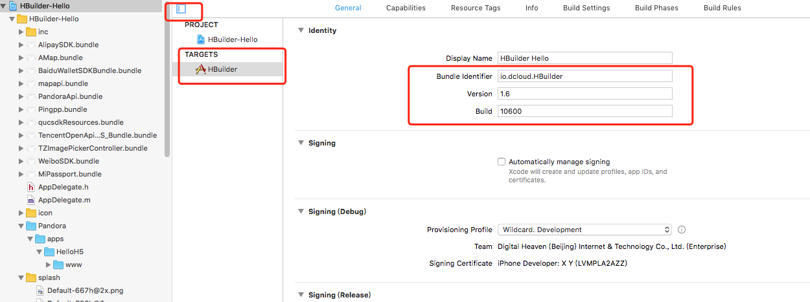

其中,Bundle Identifier为苹果的AppID，必须与应用发布是配置的Profile关联的AppID一致；

Version为应用版本号，在App Store中显示的版本号，推荐与manifest.json中version下的name值一致；

Build为编译版本号，App Store判断升级使用，推荐与manifest.json中version下的code值一致。
### <a id="name">- 配置应用名称 </a>

1、在打开的原生工程中，点击工程的targets和点开manifest文件，然后将manifest文件里的“name”字段的内容 和原生工程里的Display Name 的写成一样。

注意，manifest文件里的”name“ 对应的是HBuilderX打开的工程里的“基础配置”里的应用名称。如下图红色框所示：
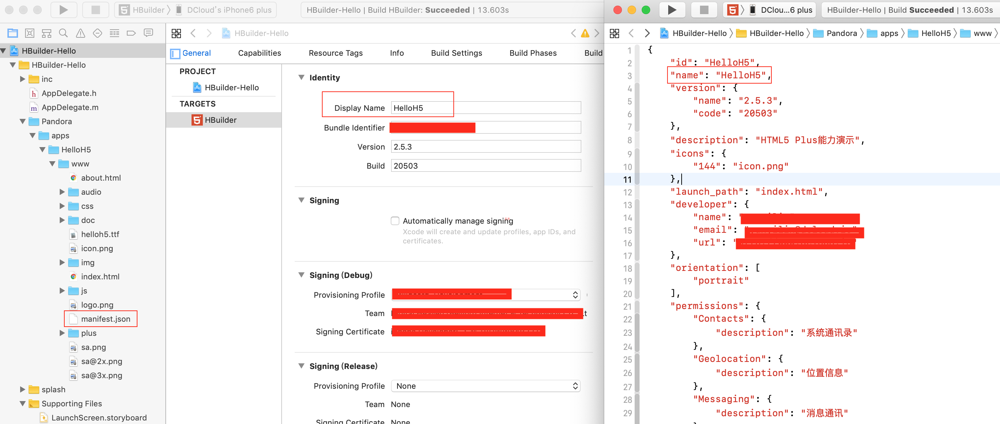
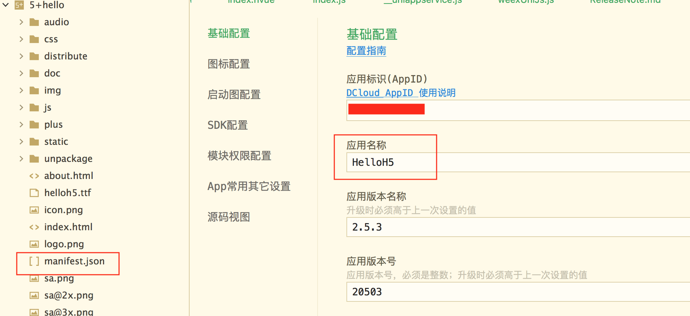

2、如果需要配置国际化，在工程导航界面，选择InfoPlist.strings文件，修改CFBundleDisplayName值为应用名字:
InfoPlist.strings(English)为英文系统应用名,Simplified为中文简体系统应用名
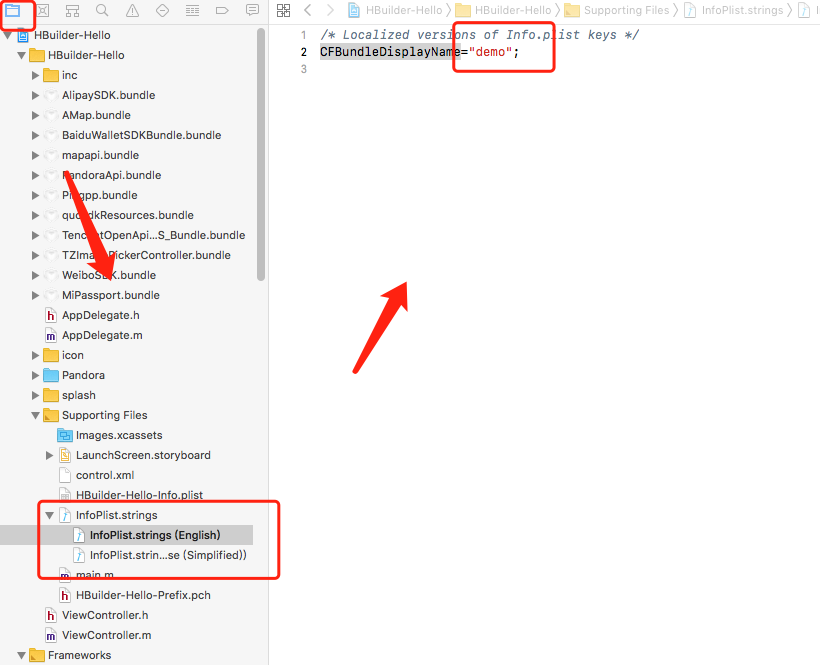
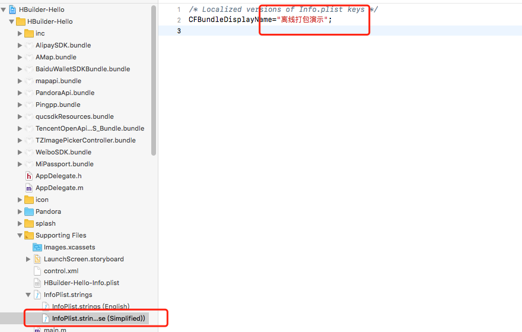

### <a id="versionname">- 配置应用版本名称 </a>
在打开的原生工程中，点击工程的targets和点开manifest文件，然后将manifest文件里的“version”字段里的“name”的内容 和原生工程里的Version 的写成一样。注意，manifest文件里的“version”字段里的“name” 对应的是HBuilderX打开的工程里的“基础配置”里的应用版本名称。如下图红色框所示：
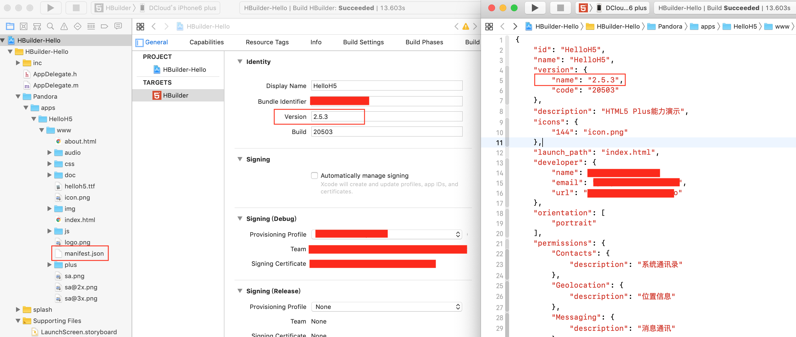
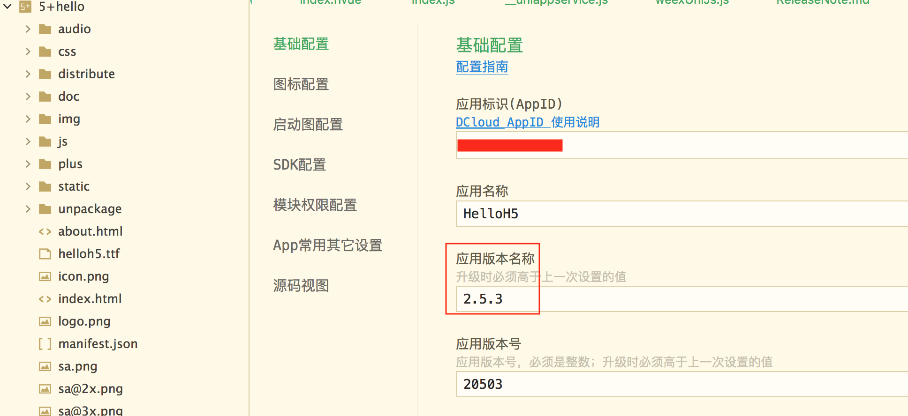

### <a id="versioncode">- 配置应用版本号 </a>
在打开的原生工程中，点击工程的targets和点开工程里的manifest文件，然后将manifest文件里的“version”字段里的“code”的内容 和原生工程里的Build 的写成一样。注意，manifest文件里的“version”字段里的“code” 对应的是HBuilderX打开的工程里的“基础配置”里的应用版本号。如下图红色框所示：
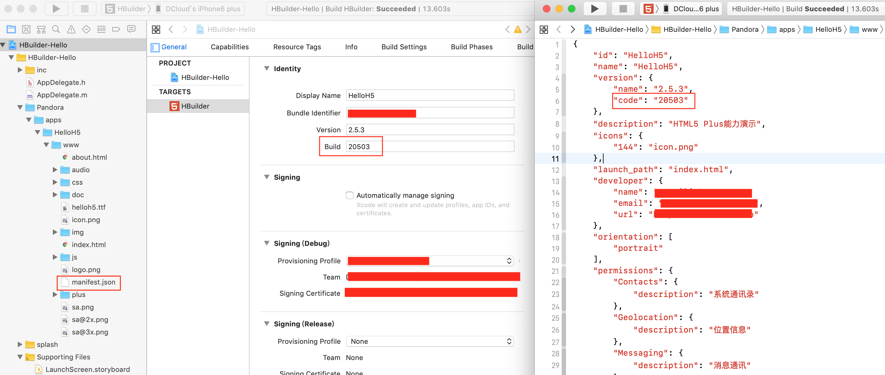

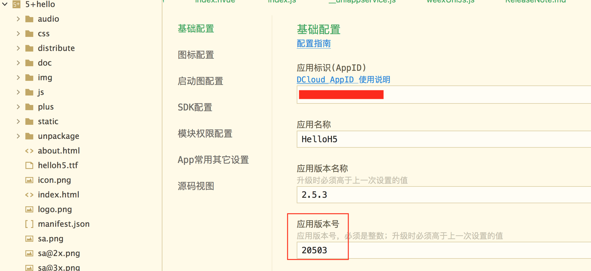

## 配置生产证书（release证书）
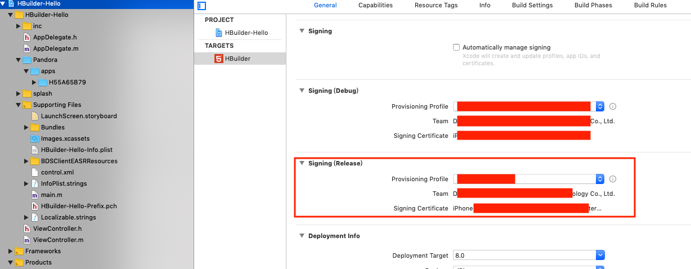

## 生成ipa包
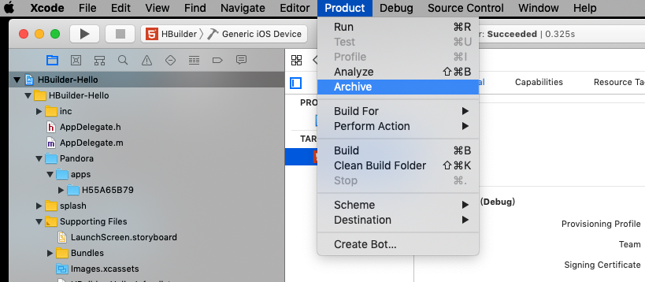
生成ipa包后，提交苹果商店。